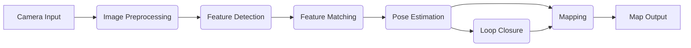

# Chapter 2: Isaac ROS and Visual SLAM

This chapter covers Isaac ROS, NVIDIA's hardware-accelerated perception framework, with a focus on Visual SLAM (VSLAM) for real-time localization and mapping. Isaac ROS bridges the gap between high-performance AI computing and robotics applications, enabling efficient processing of perception data on NVIDIA platforms.

## Learning Objectives

After completing this chapter, you will be able to:
- Set up and configure Isaac ROS for hardware-accelerated perception
- Implement Visual SLAM pipelines using Isaac ROS components
- Optimize perception pipelines for real-time performance
- Integrate Isaac ROS with traditional ROS/ROS2 nodes
- Troubleshoot common issues with Isaac ROS perception pipelines

## Prerequisites

Before starting this chapter, you should have:
- Completed Chapter 1 on Isaac Sim
- Basic understanding of ROS/ROS2 concepts (covered in Module 1)
- Understanding of SLAM concepts
- Access to NVIDIA GPU hardware

## Table of Contents

- [Introduction to Isaac ROS](#introduction-to-isaac-ros)
- [Isaac ROS Architecture](#isaac-ros-architecture)
- [Setting Up Isaac ROS](#setting-up-isaac-ros)
- [Visual SLAM Fundamentals](#visual-slam-fundamentals)
- [Building VSLAM Pipelines](#building-vslam-pipelines)
- [Hardware Acceleration](#hardware-acceleration)
- [Performance Optimization](#performance-optimization)
- [Troubleshooting](#troubleshooting)
- [Summary](#summary)

## Introduction to Isaac ROS

Isaac ROS is a collection of hardware-accelerated perception packages that leverage NVIDIA's GPU computing capabilities. It provides optimized implementations of common robotics perception algorithms that run efficiently on NVIDIA GPUs, offering significant performance improvements over CPU-only implementations.

### Key Features

1. **Hardware Acceleration**: Leverages CUDA, TensorRT, and other NVIDIA technologies
2. **ROS/ROS2 Native**: Seamlessly integrates with standard ROS/ROS2 workflows
3. **Modular Design**: Easy to integrate specific perception components
4. **Real-time Performance**: Optimized for low-latency, high-throughput processing
5. **Deep Learning Integration**: Includes optimized deep learning inference nodes

## Isaac ROS Architecture

### Core Components

Isaac ROS consists of several key components:

1. **Image Pipeline**: Hardware-accelerated image preprocessing
2. **Perception Nodes**: Optimized implementations of common perception algorithms
3. **Message Bridges**: Efficient conversion between ROS and NVIDIA formats
4. **Hardware Abstraction**: Uniform interfaces for different NVIDIA hardware

### System Architecture

```
┌─────────────────┐    ┌──────────────────┐    ┌─────────────────┐
│   ROS Nodes     │◄──►│ Isaac ROS Bridge │◄──►│  NVIDIA GPU     │
│ (Standard)      │    │                  │    │ (Processing)    │
└─────────────────┘    └──────────────────┘    └─────────────────┘
                              │
                              ▼
                      ┌──────────────────┐
                      │   Isaac Apps     │
                      │ (Perception)     │
                      └──────────────────┘
```

## Setting Up Isaac ROS

### System Requirements

- NVIDIA GPU with compute capability 6.0 or higher (Pascal architecture or newer)
- CUDA 11.4 or newer
- cuDNN 8.2 or newer
- TensorRT 8.0 or newer (for deep learning nodes)
- Ubuntu 18.04/20.04 or equivalent Linux distribution

### Installation

Isaac ROS can be installed via Docker containers or from source:

#### Docker Installation (Recommended)

```bash
# Pull the Isaac ROS Docker image
docker pull nvcr.io/nvidia/isaac-ros:latest

# Run Isaac ROS container
docker run -it --gpus all \
  --net host \
  --privileged \
  -v /tmp/.X11-unix:/tmp/.X11-unix \
  -e DISPLAY=$DISPLAY \
  nvcr.io/nvidia/isaac-ros:latest
```

#### Source Installation

```bash
# Clone the Isaac ROS workspace
mkdir -p ~/isaac_ros_ws/src
cd ~/isaac_ros_ws

# Use vcs to import packages
wget https://raw.githubusercontent.com/NVIDIA-ISAAC-ROS/.repos/main/isaac_ros.repos
vcs import src < isaac_ros.repos

# Install dependencies
rosdep install --from-paths src --ignore-src -r -y

# Build the workspace
colcon build --symlink-install --packages-select $(ros2 pkg list | grep isaac_ros_)
```

## Visual SLAM Fundamentals

Visual SLAM (VSLAM) combines visual input from cameras with simultaneous localization and mapping. Isaac ROS provides optimized implementations of VSLAM algorithms that take advantage of GPU acceleration.

### Key Concepts

1. **Feature Detection**: Identifying distinctive points in images
2. **Feature Matching**: Corresponding features across frames
3. **Pose Estimation**: Determining camera pose relative to the environment
4. **Mapping**: Building a representation of the environment
5. **Loop Closure**: Recognizing previously visited locations

### VSLAM Pipeline Components



## Building VSLAM Pipelines

### Example: Stereo VSLAM Pipeline

Here's an example launch file for a stereo VSLAM pipeline using Isaac ROS:

```xml
<!-- stereo_vslam.launch.xml -->
<launch>
  <!-- Camera drivers -->
  <node pkg="isaac_ros_stereo_image_proc" exec="stereo_image_rect" name="stereo_rectify">
    <param name="alpha" value="0.0"/>
    <param name="use_system_default_qos" value="true"/>
  </node>

  <!-- Feature detection -->
  <node pkg="isaac_ros_visual_slam" exec="isaac_ros_visual_slam" name="visual_slam">
    <param name="enable_rectification" value="true"/>
    <param name="rectified_images_input" value="true"/>
    <param name="map_frame" value="map"/>
    <param name="odom_frame" value="odom"/>
    <param name="base_frame" value="base_link"/>
    <param name="enable_observations_view" value="true"/>
    <param name="enable_slam_visualization" value="true"/>
    <param name="enable_landmarks_view" value="true"/>
    <param name="enable_mesh_map" value="true"/>
  </node>

  <!-- Pose broadcaster -->
  <node pkg="tf2_ros" exec="static_transform_publisher" name="base_to_camera">
    <arg value="0.1,0,0.1,0,0,0,base_link,camera_link"/>
  </node>
</launch>
```

### Code Example: Custom VSLAM Node

```python
import rclpy
from rclpy.node import Node
from sensor_msgs.msg import Image
from nav_msgs.msg import Odometry
from geometry_msgs.msg import PoseStamped
import numpy as np

class IsaacVSLAMNode(Node):
    """
    Example custom VSLAM node using Isaac ROS components
    """
    
    def __init__(self):
        super().__init__('isaac_vsalm_node')
        
        # Create subscribers
        self.left_img_sub = self.create_subscription(
            Image, 
            '/camera/left/image_rect', 
            self.left_img_callback, 
            10
        )
        self.right_img_sub = self.create_subscription(
            Image, 
            '/camera/right/image_rect', 
            self.right_img_callback, 
            10
        )
        
        # Create publishers
        self.odom_pub = self.create_publisher(Odometry, '/visual_odom', 10)
        self.pose_pub = self.create_publisher(PoseStamped, '/visual_pose', 10)
        
        # Initialize Isaac ROS VSLAM components
        self.initialize_vsalm_pipeline()
        
        self.get_logger().info('Isaac VSLAM node initialized')
    
    def initialize_vsalm_pipeline(self):
        """
        Initialize the Isaac ROS VSLAM pipeline
        """
        # In practice, this would initialize Isaac ROS components
        # For example, using the Isaac ROS Visual SLAM package
        self.get_logger().info('Initializing VSLAM pipeline...')
        
        # Set up internal state
        self.prev_left_img = None
        self.prev_right_img = None
        self.current_pose = np.eye(4)  # 4x4 transformation matrix
        
    def left_img_callback(self, msg):
        """
        Process left camera image
        """
        if self.prev_left_img is not None:
            # Perform stereo matching and pose estimation
            self.estimate_pose()
        
        self.prev_left_img = msg
    
    def right_img_callback(self, msg):
        """
        Process right camera image
        """
        if self.prev_right_img is not None:
            # Use right image for stereo depth estimation
            self.compute_depth()
        
        self.prev_right_img = msg
    
    def estimate_pose(self):
        """
        Estimate camera pose using stereo images
        """
        # This would use Isaac ROS optimized functions
        # In a real implementation, this would call Isaac ROS VSLAM functions
        delta_pose = self.compute_stereo_odometry()
        
        # Update global pose
        self.current_pose = self.current_pose @ delta_pose
        
        # Publish odometry
        self.publish_odometry()
    
    def compute_depth(self):
        """
        Compute depth from stereo images
        """
        # This would use Isaac ROS stereo processing nodes
        pass
    
    def compute_stereo_odometry(self):
        """
        Compute stereo odometry (simplified)
        """
        # In practice, this would use Isaac ROS optimized stereo matching
        # Return a 4x4 transformation matrix
        return np.eye(4)  # Identity matrix as placeholder
    
    def publish_odometry(self):
        """
        Publish odometry message
        """
        odom_msg = Odometry()
        odom_msg.header.stamp = self.get_clock().now().to_msg()
        odom_msg.header.frame_id = 'map'
        odom_msg.child_frame_id = 'base_link'
        
        # Extract position and orientation from pose matrix
        position = self.current_pose[:3, 3]
        quaternion = self.matrix_to_quaternion(self.current_pose[:3, :3])
        
        odom_msg.pose.pose.position.x = position[0]
        odom_msg.pose.pose.position.y = position[1]
        odom_msg.pose.pose.position.z = position[2]
        
        odom_msg.pose.pose.orientation.w = quaternion[0]
        odom_msg.pose.pose.orientation.x = quaternion[1]
        odom_msg.pose.pose.orientation.y = quaternion[2]
        odom_msg.pose.pose.orientation.z = quaternion[3]
        
        self.odom_pub.publish(odom_msg)
    
    def matrix_to_quaternion(self, rotation_matrix):
        """
        Convert rotation matrix to quaternion
        """
        trace = np.trace(rotation_matrix)
        if trace > 0:
            s = np.sqrt(trace + 1.0) * 2
            w = 0.25 * s
            x = (rotation_matrix[2, 1] - rotation_matrix[1, 2]) / s
            y = (rotation_matrix[0, 2] - rotation_matrix[2, 0]) / s
            z = (rotation_matrix[1, 0] - rotation_matrix[0, 1]) / s
        else:
            if rotation_matrix[0, 0] > rotation_matrix[1, 1] and rotation_matrix[0, 0] > rotation_matrix[2, 2]:
                s = np.sqrt(1.0 + rotation_matrix[0, 0] - rotation_matrix[1, 1] - rotation_matrix[2, 2]) * 2
                w = (rotation_matrix[2, 1] - rotation_matrix[1, 2]) / s
                x = 0.25 * s
                y = (rotation_matrix[0, 1] + rotation_matrix[1, 0]) / s
                z = (rotation_matrix[0, 2] + rotation_matrix[2, 0]) / s
            elif rotation_matrix[1, 1] > rotation_matrix[2, 2]:
                s = np.sqrt(1.0 + rotation_matrix[1, 1] - rotation_matrix[0, 0] - rotation_matrix[2, 2]) * 2
                w = (rotation_matrix[0, 2] - rotation_matrix[2, 0]) / s
                x = (rotation_matrix[0, 1] + rotation_matrix[1, 0]) / s
                y = 0.25 * s
                z = (rotation_matrix[1, 2] + rotation_matrix[2, 1]) / s
            else:
                s = np.sqrt(1.0 + rotation_matrix[2, 2] - rotation_matrix[0, 0] - rotation_matrix[1, 1]) * 2
                w = (rotation_matrix[1, 0] - rotation_matrix[0, 1]) / s
                x = (rotation_matrix[0, 2] + rotation_matrix[2, 0]) / s
                y = (rotation_matrix[1, 2] + rotation_matrix[2, 1]) / s
                z = 0.25 * s
        
        return [w, x, y, z]

def main(args=None):
    rclpy.init(args=args)
    node = IsaacVSLAMNode()
    
    try:
        rclpy.spin(node)
    except KeyboardInterrupt:
        pass
    finally:
        node.destroy_node()
        rclpy.shutdown()

if __name__ == '__main__':
    main()
```

## Hardware Acceleration

### GPU Optimization Strategies

Isaac ROS leverages several NVIDIA technologies for hardware acceleration:

1. **CUDA**: For parallel processing of image data
2. **TensorRT**: For optimized neural network inference
3. **OpenCV GPU**: For accelerated computer vision operations
4. **OpenGL/Vulkan**: For rendering operations

### Example: Optimized Image Processing Pipeline

```python
import rclpy
from rclpy.node import Node
from sensor_msgs.msg import Image
from cv_bridge import CvBridge
import cv2
import numpy as np

class OptimizedImageProcessor(Node):
    """
    Example of hardware-accelerated image processing using Isaac ROS
    """
    
    def __init__(self):
        super().__init__('optimized_image_processor')
        
        self.bridge = CvBridge()
        
        # Subscribe to image topic
        self.image_sub = self.create_subscription(
            Image,
            '/camera/image_raw',
            self.image_callback,
            10
        )
        
        # Publisher for processed image
        self.processed_pub = self.create_publisher(Image, '/camera/image_processed', 10)
        
        # Initialize CUDA-based processing
        self.init_cuda_processing()
        
        self.get_logger().info('Optimized image processor initialized')
    
    def init_cuda_processing(self):
        """
        Initialize CUDA-based image processing
        """
        # Check if CUDA is available
        if cv2.cuda.getCudaEnabledDeviceCount() == 0:
            self.get_logger().warning('No CUDA-enabled device found, falling back to CPU processing')
            self.use_cuda = False
        else:
            self.get_logger().info('CUDA-enabled device found, using GPU acceleration')
            self.use_cuda = True
            
            # Create CUDA streams for parallel processing
            self.stream = cv2.cuda.Stream()
    
    def image_callback(self, msg):
        """
        Process incoming image with hardware acceleration
        """
        try:
            # Convert ROS Image to OpenCV
            cv_image = self.bridge.imgmsg_to_cv2(msg, desired_encoding='bgr8')
            
            if self.use_cuda:
                # Upload image to GPU
                gpu_mat = cv2.cuda_GpuMat()
                gpu_mat.upload(cv_image, stream=self.stream)
                
                # Perform processing on GPU
                processed_gpu = self.gpu_process(gpu_mat)
                
                # Download result from GPU
                processed_image = processed_gpu.download(stream=self.stream)
                self.stream.waitForCompletion()
            else:
                # Fallback to CPU processing
                processed_image = self.cpu_process(cv_image)
            
            # Publish processed image
            processed_msg = self.bridge.cv2_to_imgmsg(processed_image, encoding='bgr8')
            processed_msg.header = msg.header  # Preserve header
            self.processed_pub.publish(processed_msg)
            
        except Exception as e:
            self.get_logger().error(f'Error processing image: {str(e)}')
    
    def gpu_process(self, gpu_mat):
        """
        Perform image processing on GPU
        """
        # Example: Gaussian blur on GPU
        blurred = cv2.cuda.GaussianBlur(gpu_mat, (15, 15), 0, 0, borderType=cv2.BORDER_REFLECT)
        
        # Example: Convert to grayscale on GPU
        gray = cv2.cuda.cvtColor(blurred, cv2.COLOR_BGR2GRAY)
        
        # Convert back to BGR for output
        result = cv2.cuda.cvtColor(gray, cv2.COLOR_GRAY2BGR)
        
        return result
    
    def cpu_process(self, cv_image):
        """
        Fallback CPU processing
        """
        # Same operations as GPU but on CPU
        blurred = cv2.GaussianBlur(cv_image, (15, 15), 0)
        gray = cv2.cvtColor(blurred, cv2.COLOR_BGR2GRAY)
        result = cv2.cvtColor(gray, cv2.COLOR_GRAY2BGR)
        
        return result

def main(args=None):
    rclpy.init(args=args)
    node = OptimizedImageProcessor()
    
    try:
        rclpy.spin(node)
    except KeyboardInterrupt:
        pass
    finally:
        node.destroy_node()
        rclpy.shutdown()

if __name__ == '__main__':
    main()
```

## Performance Optimization

### Profiling and Monitoring

To optimize performance of Isaac ROS pipelines:

1. **Use Isaac ROS Profiler**: Built-in profiling tools for performance analysis
2. **Monitor GPU Utilization**: Use `nvidia-smi` to monitor GPU usage
3. **Profile Individual Nodes**: Isolate performance bottlenecks
4. **Pipeline Analysis**: Analyze data flow and processing delays

### Example: Performance Monitoring

```python
import rclpy
from rclpy.node import Node
from sensor_msgs.msg import Image
import time
import psutil

class PerformanceMonitor(Node):
    """
    Monitor performance of Isaac ROS pipeline
    """
    
    def __init__(self):
        super().__init__('performance_monitor')
        
        # Subscribe to image topic
        self.image_sub = self.create_subscription(
            Image,
            '/camera/image_raw',
            self.image_callback,
            10
        )
        
        # Timer for periodic reporting
        self.timer = self.create_timer(1.0, self.report_performance)
        
        # Performance counters
        self.frame_count = 0
        self.last_report_time = time.time()
        self.gpu_utilization = 0
        
        self.get_logger().info('Performance monitor initialized')
    
    def image_callback(self, msg):
        """
        Process image and measure performance
        """
        start_time = time.time()
        
        # Simulate processing time
        time.sleep(0.01)  # Simulate 10ms processing
        
        end_time = time.time()
        processing_time = (end_time - start_time) * 1000  # Convert to ms
        
        # Check GPU utilization (simplified)
        try:
            import GPUtil
            gpus = GPUtil.getGPUs()
            if gpus:
                self.gpu_utilization = gpus[0].load * 100
        except ImportError:
            self.gpu_utilization = 0  # GPU monitoring not available
        
        self.frame_count += 1
        
        # Log performance if significantly slow
        if processing_time > 50:  # More than 50ms processing
            self.get_logger().warn(f'Slow processing detected: {processing_time:.2f}ms')
    
    def report_performance(self):
        """
        Report performance statistics
        """
        current_time = time.time()
        elapsed_time = current_time - self.last_report_time
        
        if elapsed_time > 0:
            fps = self.frame_count / elapsed_time
            avg_cpu = psutil.cpu_percent()
            avg_memory = psutil.virtual_memory().percent
            
            self.get_logger().info(
                f'Performance: {fps:.2f} FPS, CPU: {avg_cpu:.1f}%, '
                f'Memory: {avg_memory:.1f}%, GPU: {self.gpu_utilization:.1f}%'
            )
        
        # Reset counters
        self.frame_count = 0
        self.last_report_time = current_time

def main(args=None):
    rclpy.init(args=args)
    node = PerformanceMonitor()
    
    try:
        rclpy.spin(node)
    except KeyboardInterrupt:
        pass
    finally:
        node.destroy_node()
        rclpy.shutdown()

if __name__ == '__main__':
    main()
```

## Troubleshooting

### Common Issues and Solutions

1. **GPU Not Detected**:
   - Verify CUDA installation: `nvidia-smi`
   - Check Isaac ROS Docker container launched with `--gpus all`
   - Verify driver compatibility

2. **Performance Issues**:
   - Check GPU memory usage
   - Verify image resolution is appropriate
   - Profile individual pipeline components

3. **Memory Leaks**:
   - Use memory monitoring tools
   - Implement proper cleanup of GPU memory
   - Check for circular references

4. **Synchronization Problems**:
   - Verify timestamp synchronization between sensors
   - Check message queue sizes
   - Use appropriate QoS profiles

### Debugging Tips

- Use Isaac ROS diagnostic tools
- Enable detailed logging: `--log-level debug`
- Monitor system resources during operation
- Test individual components separately before integration

## Summary

In this chapter, we explored Isaac ROS and its capabilities for hardware-accelerated perception:
- Understanding the architecture and components of Isaac ROS
- Setting up Isaac ROS for development and deployment
- Building Visual SLAM pipelines with Isaac ROS components
- Leveraging hardware acceleration for real-time performance
- Optimizing performance and troubleshooting common issues

Isaac ROS enables efficient processing of perception data by leveraging NVIDIA's GPU computing capabilities. In the next chapter, we'll explore Nav2 for advanced path planning and control for humanoid robots.