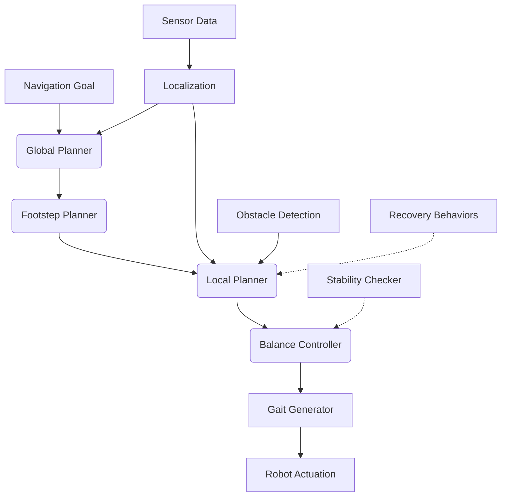

# Chapter 3: Nav2 for Humanoid Navigation

This chapter covers the Nav2 stack for advanced path planning and control for bipedal humanoid robots in complex environments. We'll explore how to configure Nav2 specifically for humanoid navigation, addressing the unique challenges of bipedal locomotion and balance.

## Learning Objectives

After completing this chapter, you will be able to:
- Configure Nav2 for bipedal humanoid robots in complex environments
- Tune navigation parameters for stable bipedal movement
- Implement advanced path planning techniques for humanoid robots
- Integrate Nav2 with perception systems for robust navigation
- Troubleshoot common humanoid navigation issues

## Prerequisites

Before starting this chapter, you should have:
- Completed Chapter 1 and 2 of this module
- Understanding of basic navigation concepts
- Familiarity with ROS 2 and Nav2 (from Module 1)
- Knowledge of humanoid robot kinematics and locomotion

## Table of Contents

- [Introduction to Humanoid Navigation](#introduction-to-humanoid-navigation)
- [Nav2 Architecture for Humanoids](#nav2-architecture-for-humanoids)
- [Humanoid-Specific Configuration](#humanoid-specific-configuration)
- [Path Planning for Bipedal Robots](#path-planning-for-bipedal-robots)
- [Control Systems for Humanoid Navigation](#control-systems-for-humanoid-navigation)
- [Localization for Humanoid Robots](#localization-for-humanoid-robots)
- [Performance Tuning](#performance-tuning)
- [Troubleshooting](#troubleshooting)
- [Summary](#summary)

## Introduction to Humanoid Navigation

Navigation for humanoid robots presents unique challenges compared to wheeled or tracked robots. Bipedal locomotion requires careful consideration of balance, stability, and gait patterns that differ significantly from conventional mobile robots.

### Key Challenges

1. **Balance and Stability**: Maintaining balance during navigation maneuvers
2. **Gait Patterns**: Coordinating leg movements for stable walking
3. **Footstep Planning**: Planning where to place feet for stable locomotion
4. **Dynamic Obstacles**: Dealing with moving obstacles in shared human spaces
5. **Terrain Adaptation**: Navigating uneven surfaces and obstacles

### Differences from Traditional Navigation

Humanoid navigation differs from traditional mobile robot navigation in several ways:

- **Kinematic Constraints**: Limited turning radius and specific gait requirements
- **Dynamic Stability**: Requires continuous balance adjustment
- **Footprint Planning**: Path planning must consider individual footsteps
- **Energy Efficiency**: Gait optimization for battery life
- **Social Navigation**: Compliance with human social norms

## Nav2 Architecture for Humanoids

### Standard Nav2 Components

Nav2 provides a flexible navigation system with the following main components:

1. **Global Planner**: Creates optimal path from start to goal
2. **Local Planner**: Executes path while avoiding obstacles
3. **Controller**: Converts path to robot commands
4. **Recovery Behaviors**: Handles navigation failures
5. **Transform System**: Manages coordinate frames

### Humanoid-Specific Modifications

For humanoid robots, several Nav2 components require adaptation:

1. **Footstep Planner**: Generates stable footstep sequences
2. **Balance Controller**: Maintains center of mass during movement
3. **Gait Generator**: Produces coordinated leg movements
4. **Stability Checker**: Validates planned motions for balance

### Architecture Diagram



## Humanoid-Specific Configuration

### Parameter Configuration for Humanoids

Nav2 requires specific configuration adjustments for humanoid robots:

```yaml
# nav2_params_humanoid.yaml
amcl:
  ros__parameters:
    use_sim_time: false
    alpha1: 0.2
    alpha2: 0.2
    alpha3: 0.2
    alpha4: 0.2
    alpha5: 0.2
    base_frame_id: "base_footprint"
    beam_skip_distance: 0.5
    beam_skip_error_threshold: 0.9
    beam_skip_threshold: 0.3
    do_beamskip: false
    global_frame_id: "map"
    lambda_short: 0.1
    likelihood_max_dist: 2.0
    set_initial_pose: true
    initial_pose:
      x: 0.0
      y: 0.0
      z: 0.0
      yaw: 0.0
    tf_broadcast: true
    transform_tolerance: 1.0
    update_min_a: 0.2
    update_min_d: 0.2
    z_hit: 0.5
    z_max: 0.05
    z_rand: 0.5
    z_short: 0.05

bt_navigator:
  ros__parameters:
    use_sim_time: false
    global_frame: map
    robot_base_frame: base_footprint
    odom_topic: /odom
    bt_loop_duration: 10
    default_server_timeout: 20
    enable_groot_monitoring: True
    groot_zmq_publisher_port: 1666
    groot_zmq_server_port: 1667
    default_nav_through_poses_bt_xml: /opt/nav2/share/nav2_bt_navigator/bt_xml_v0/nav_through_poses_w_replanning_and_recovery.xml
    default_nav_to_pose_bt_xml: /opt/nav2/share/nav2_bt_navigator/bt_xml_v0/nav_to_pose_w_replanning_and_recovery.xml
    plugin_lib_names:
      - nav2_compute_path_to_pose_action_bt_node
      - nav2_compute_path_through_poses_action_bt_node
      - nav2_smooth_path_action_bt_node
      - nav2_follow_path_action_bt_node
      - nav2_spin_action_bt_node
      - nav2_wait_action_bt_node
      - nav2_assisted_teleop_action_bt_node
      - nav2_back_up_action_bt_node
      - nav2_drive_on_heading_bt_node
      - nav2_clear_costmap_service_bt_node
      - nav2_is_stuck_condition_bt_node
      - nav2_goal_reached_condition_bt_node
      - nav2_goal_updated_condition_bt_node
      - nav2_globally_cleared_condition_bt_node
      - nav2_locally_cleared_condition_bt_node
      - nav2_initial_pose_received_condition_bt_node
      - nav2_reinitialize_global_localization_service_bt_node
      - nav2_rate_controller_bt_node
      - nav2_distance_controller_bt_node
      - nav2_speed_controller_bt_node
      - nav2_truncate_path_action_bt_node
      - nav2_truncate_path_local_action_bt_node
      - nav2_goal_updater_node_bt_node
      - nav2_recovery_node_bt_node
      - nav2_pipeline_sequence_bt_node
      - nav2_round_robin_node_bt_node
      - nav2_fallback_node_bt_node
      - nav2_if_then_else_node_bt_node
      - nav2_while_do_loop_node_bt_node
      - nav2_wait_cancel_bt_node
      - nav2_is_path_valid_condition_bt_node
      - nav2_remove_passed_goals_action_bt_node
      - nav2_planner_selector_bt_node
      - nav2_controller_selector_bt_node
      - nav2_goal_checker_selector_bt_node
      - nav2_controller_cancel_bt_node
      - nav2_path_longer_on_approach_bt_node
      - nav2_get_path_on_approach_bt_node
      - nav2_get_path_to_relative_point_action_bt_node
      - nav2_is_battery_low_condition_bt_node
      - nav2_navigate_through_poses_action_bt_node
      - nav2_navigate_to_pose_action_bt_node
      - nav2_remove_passed_raceway_points_action_bt_node
      - nav2_compute_path_from_pose_to_pose_action_bt_node
      - nav2_compute_path_to_raceway_points_action_bt_node

controller_server:
  ros__parameters:
    use_sim_time: false
    controller_frequency: 20.0
    min_x_velocity_threshold: 0.001
    min_y_velocity_threshold: 0.5
    min_theta_velocity_threshold: 0.001
    progress_checker_plugin: "progress_checker"
    goal_checker_plugin: "goal_checker"
    controller_plugins: ["FollowPath"]

    # Humanoid-specific controller
    FollowPath:
      plugin: "nav2_mppi_controller::MppiController"
      time_steps: 24
      control_freq: 20.0
      horizon: 1.5
      dt: 0.05
      vx_std: 0.2
      vy_std: 0.2
      wz_std: 0.3
      iteration_count: 10
      control_oversampling_ratio: 1
      xy_goal_tolerance: 0.25
      yaw_goal_tolerance: 0.25
      stateful: true
      analytical_sampling: true
      backup_restore_ratio: 0.8
      reference_track_error_scale: 2.0
      progress_check_tolerance: 0.2
      goal_check_tolerance: 0.2
      cmd_vel_limits:
        vx: [0.0, 0.3, 0.0]  # Humanoid-specific speed limits
        vy: [0.0, 0.0, 0.0]  # No lateral movement
        wz: [-0.5, 0.5, 0.0]  # Angular velocity limits

local_costmap:
  local_costmap:
    ros__parameters:
      update_frequency: 5.0
      publish_frequency: 2.0
      global_frame: odom
      robot_base_frame: base_footprint
      use_sim_time: false
      rolling_window: true
      width: 6
      height: 6
      resolution: 0.05
      robot_radius: 0.3  # Humanoid-specific radius
      plugins: ["voxel_layer", "inflation_layer"]
      inflation_layer:
        plugin: "nav2_costmap_2d::InflationLayer"
        cost_scaling_factor: 3.0
        inflation_radius: 0.55
      voxel_layer:
        plugin: "nav2_costmap_2d::VoxelLayer"
        enabled: true
        publish_voxel_map: true
        origin_z: 0.0
        z_resolution: 0.2
        z_voxels: 10
        max_obstacle_height: 2.0
        mark_threshold: 0
        observation_sources: scan
        scan:
          topic: /scan
          max_obstacle_height: 2.0
          clearing: true
          marking: true
          data_type: "LaserScan"
          raytrace_max_range: 3.0
          raytrace_min_range: 0.0
          obstacle_max_range: 2.5
          obstacle_min_range: 0.0
      always_send_full_costmap: true

global_costmap:
  global_costmap:
    ros__parameters:
      update_frequency: 1.0
      publish_frequency: 1.0
      global_frame: map
      robot_base_frame: base_footprint
      use_sim_time: false
      robot_radius: 0.3  # Humanoid-specific radius
      resolution: 0.05
      plugins: ["static_layer", "obstacle_layer", "inflation_layer"]
      obstacle_layer:
        plugin: "nav2_costmap_2d::ObstacleLayer"
        enabled: true
        observation_sources: scan
        scan:
          topic: /scan
          max_obstacle_height: 2.0
          clearing: true
          marking: true
          data_type: "LaserScan"
          raytrace_max_range: 3.0
          raytrace_min_range: 0.0
          obstacle_max_range: 2.5
          obstacle_min_range: 0.0
      static_layer:
        plugin: "nav2_costmap_2d::StaticLayer"
        map_subscribe_transient_local: true
      inflation_layer:
        plugin: "nav2_costmap_2d::InflationLayer"
        cost_scaling_factor: 3.0
        inflation_radius: 0.55
      always_send_full_costmap: true

planner_server:
  ros__parameters:
    expected_planner_frequency: 20.0
    use_sim_time: false
    planner_plugins: ["GridBased"]
    GridBased:
      plugin: "nav2_navfn_planner::NavfnPlanner"
      tolerance: 0.5
      use_astar: false
      allow_unknown: true

smoother_server:
  ros__parameters:
    use_sim_time: false
    smoother_plugins: ["simple_smoother"]
    simple_smoother:
      plugin: "nav2_smoother::SimpleSmoother"
      tolerance: 0.01
      max_its: 1000
      weight_smooth: 0.3
      weight_data: 0.1